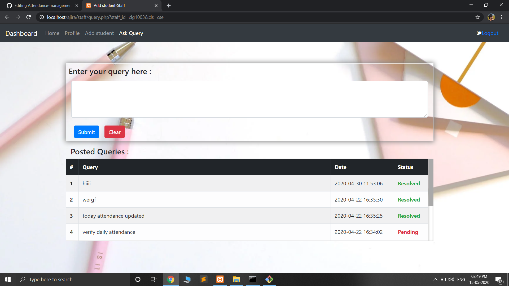

Web application for attendance management.

Link - [Attendance-management-system](https://attendance-flask-app.herokuapp.com/)

Tech stack
* HTML+CSS
* Bootstrap
* PHP
* Flask

Database
* MySQL

HOME PAGE

LOGIN PAGE

STUDENT DASHBOARD

STAFF DASHBOARD

STAFF QUERY PAGE

ADMIN DASHBOARD

ADMIN INBOX

